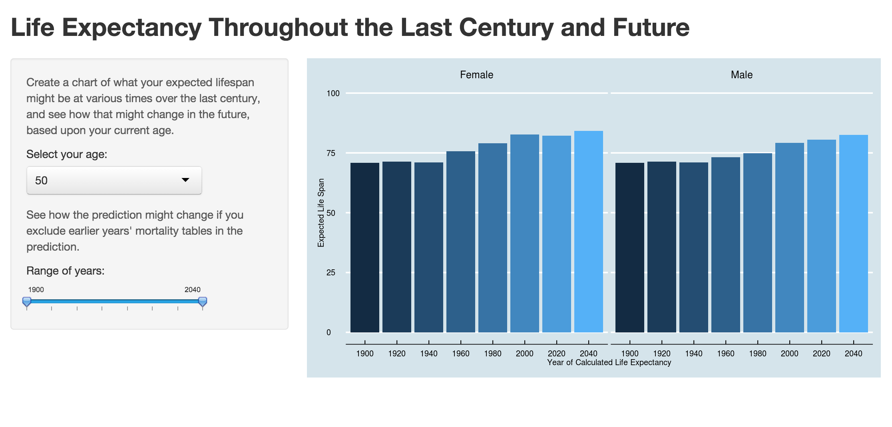

Life Expectancy Calculator Presentation
========================================================
author: Timothy J Carroll 
date: 1/22/2015

Basic Application Information
========================================================

This application predicts future life expectancy based up
past mortality tables, using a linear model. The tables used 
for this are:

- 1900 uses the American Experience Mortality table, 3 year female setback. 
- 1920 uses the American Men table, 3 year female setback.
- 1940 uses the 41 CSO Mortality table, 3 year female setback.
- 1960 uses the 58 CSO ALB Mortality table, 3 year female setback.
- 1980 uses the 80 CSO ALB Mortality with male and female mortality.
- 2000 uses the 2001 CSO ALB Mortality with male and female mortality.

Linear Model Fit Example
========================================================

For each life expectancy prediction the data is subset for the given
age and then a linear model calculated for the years for 2000 and below
that are within the slider range. The model is recalculated when any data is changed.

```r
set.seed(31416)
LifeExp <- read.csv("data/LifeExp.csv")

a <- LifeExp[LifeExp$age == 50 &
                 LifeExp$year >= 1900 &
                 LifeExp$year <= 2040 ,]
n <- nrow(a) 
m <- nrow(a[a$year > 2000,])
fit <- lm(exp ~ year + sex, data = a[1:(n-m),])
```

Resulting Model
========================================================

The linear model for the specific age is used for the 2020 and 2040 life 
expectancy prediction, if those years are within the slider range. 


```

Call:
lm(formula = exp ~ year + sex, data = a[1:(n - m), ])

Coefficients:
(Intercept)         year      sexMale  
   -172.002        0.101       -1.690  
```

Resulting Chart
========================================================

The chart will give a simple illustration of past and future additional 
life expectancy.


https://timothyjrides.shinyapps.io/LifeExp/
